# Deerhorn organ

## About

This notes are based on my Deerhorn Organ, acquired from Patch Point in 2021.

## Images

### Front

<!-- 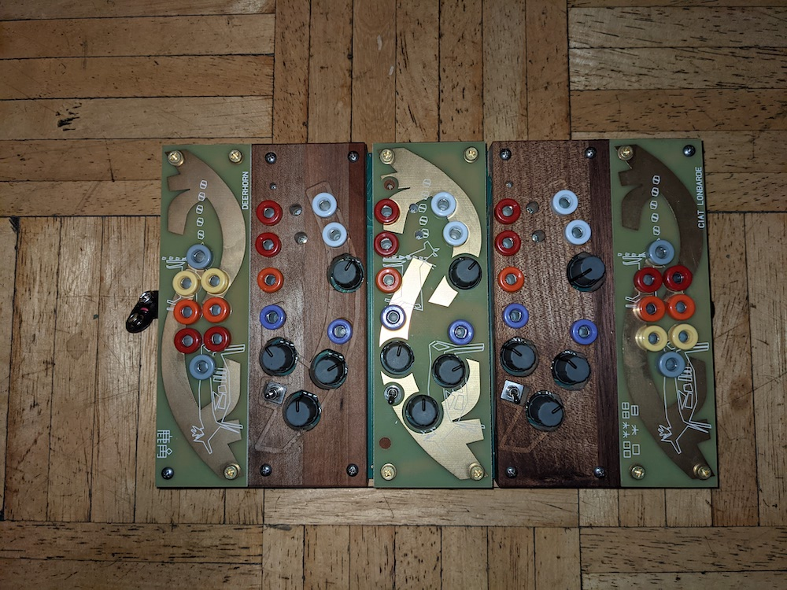 -->

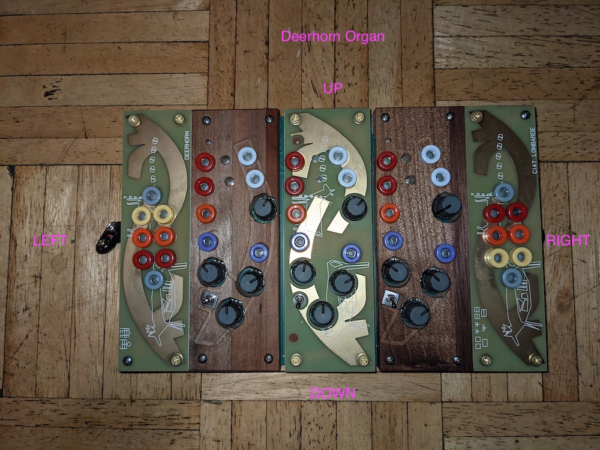

### Up

<!-- 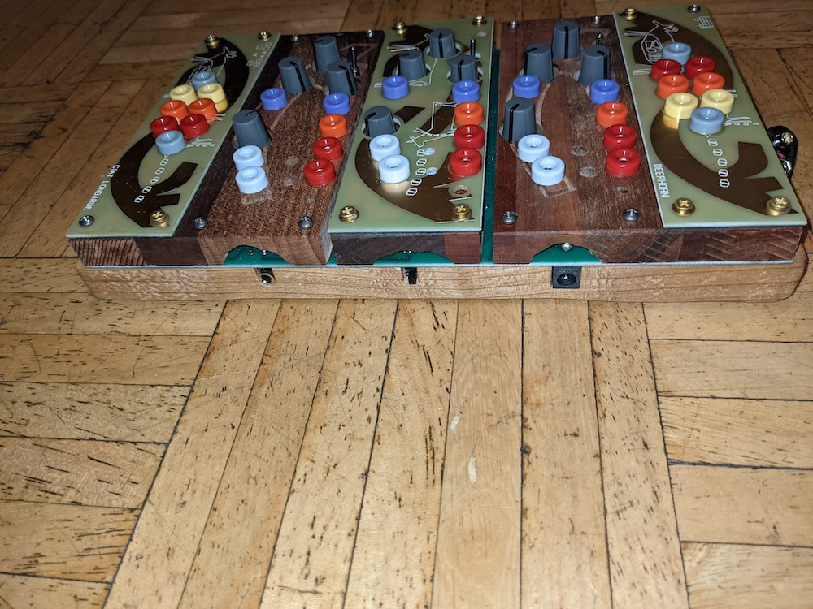 -->

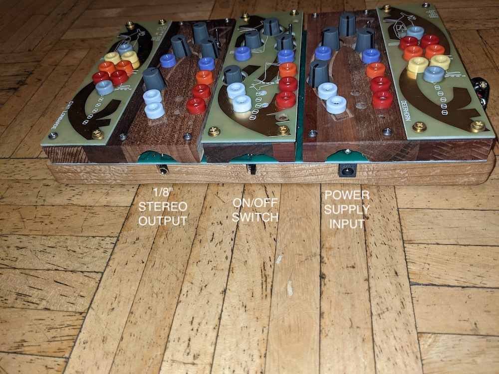

### Down

<!-- 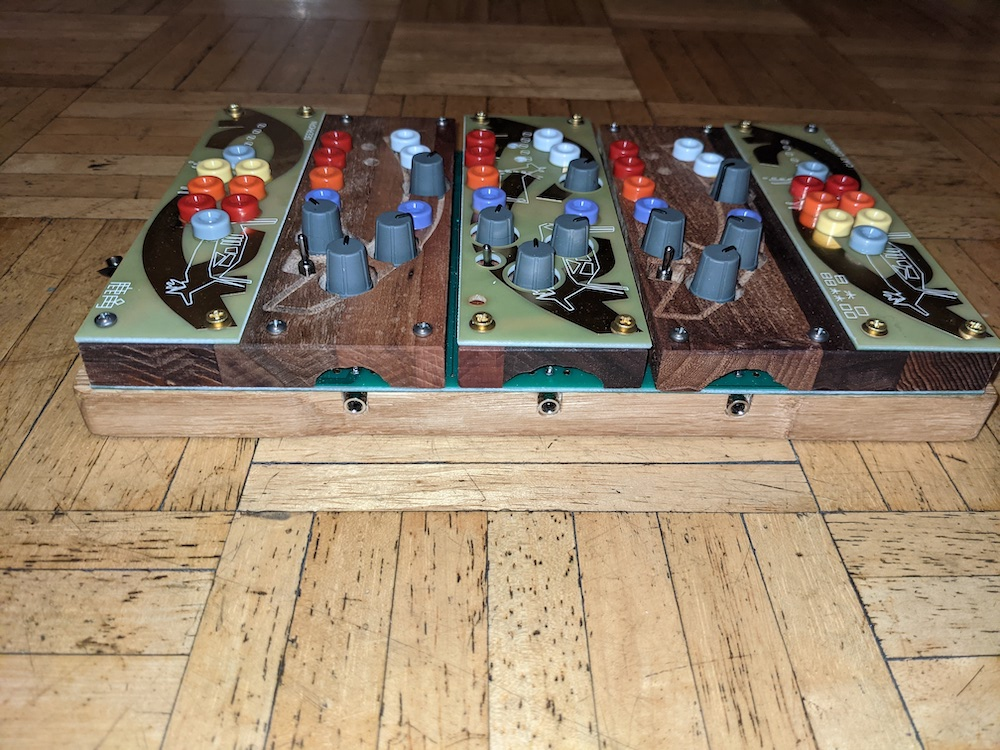 -->

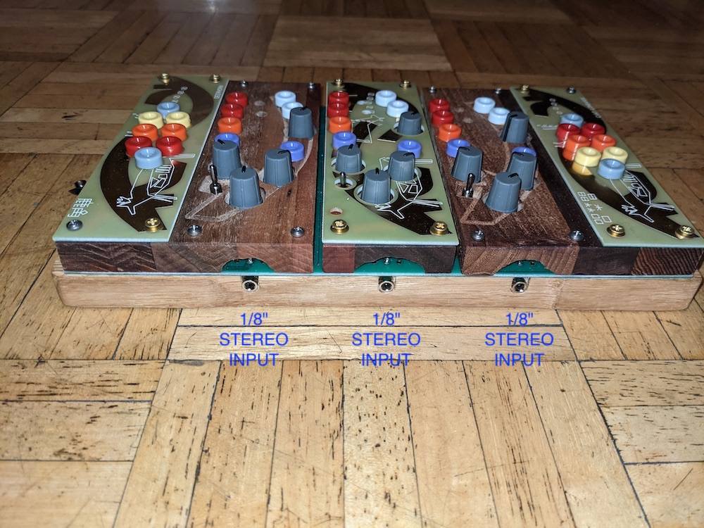

### Left

<!-- 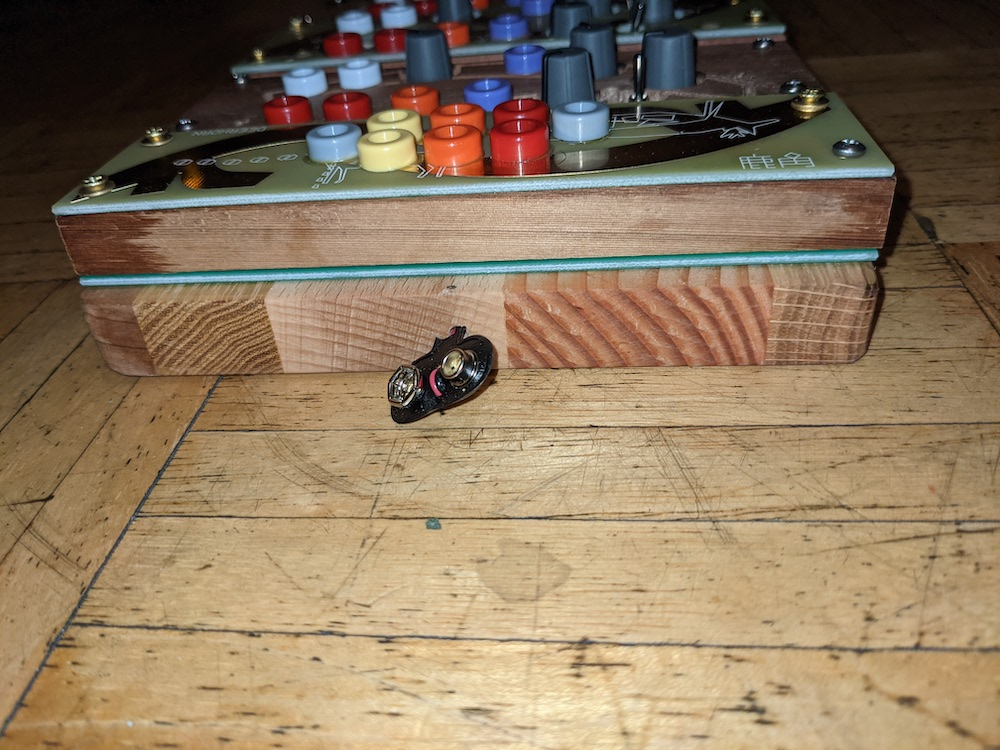 -->

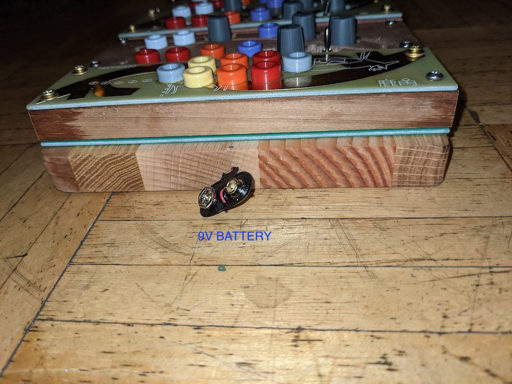

### Right

<!-- 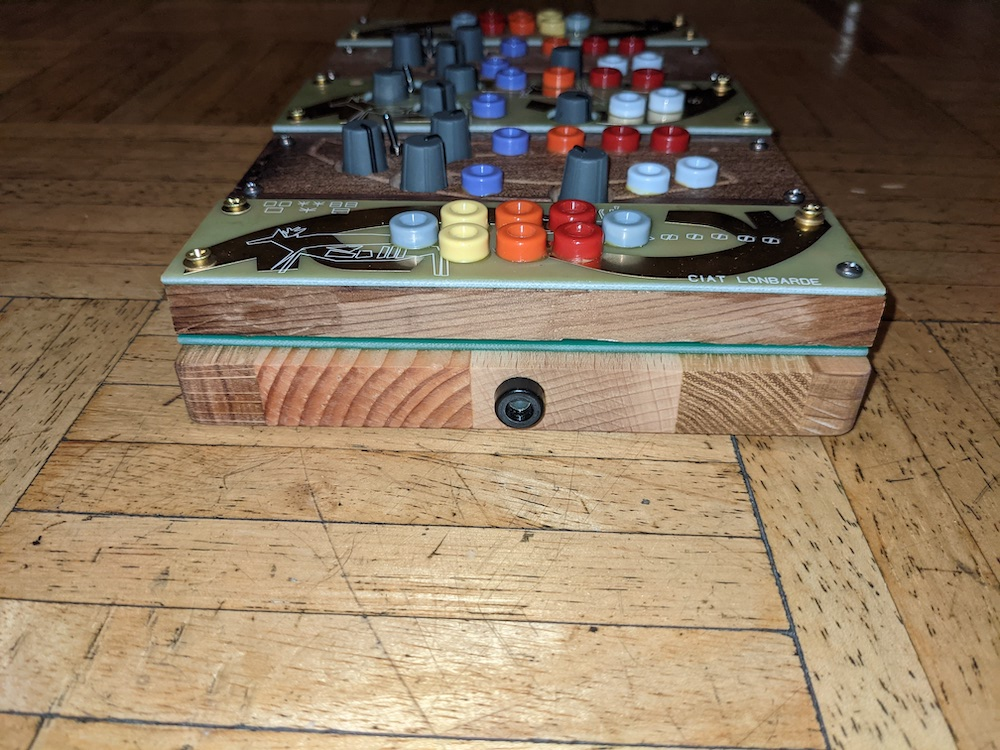 -->

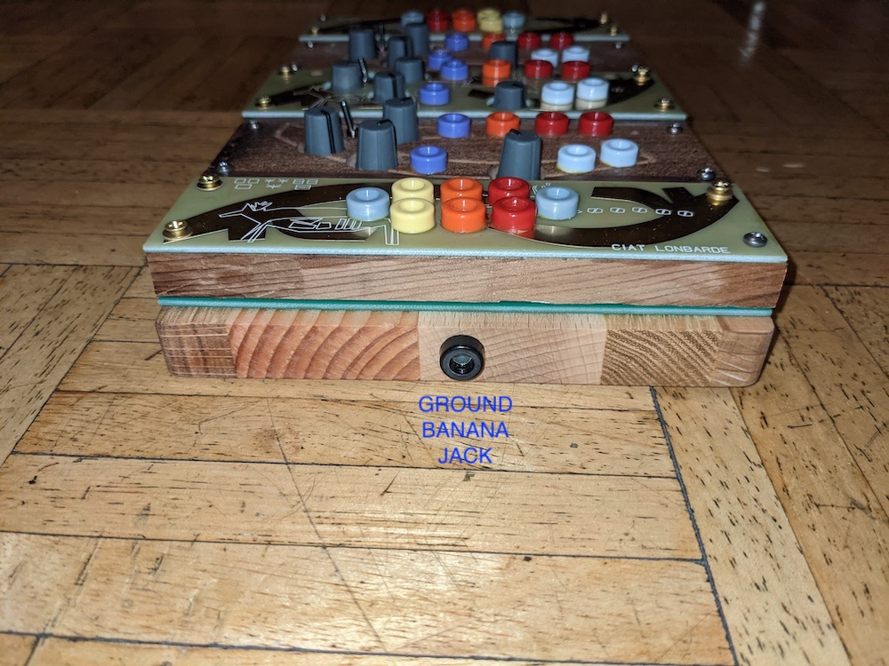

### Back

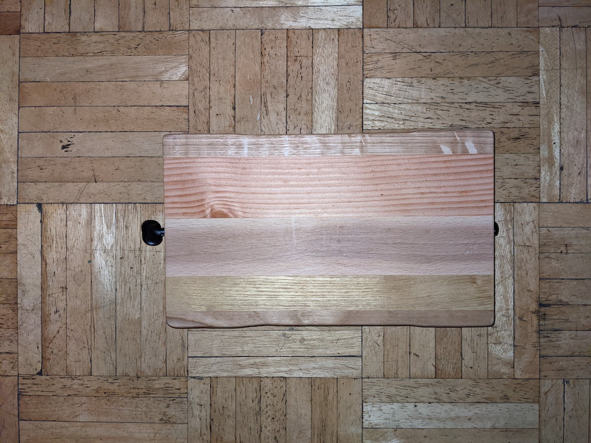

# Audio

* 3x 1/8" stereo inputs: one for each deerhorn
* 1x 1/8" stereo output: one stereo output

# Jacks

37 jacks

* 4x gray
* 4x yellow
* 7x orange
* 10x red
* 6x white
* 6x purple

# Knobs

12 knobs

# Sensors

3 horns

# Lights

6x lights

* 2x red
* 2x orange
* 2x yellow
