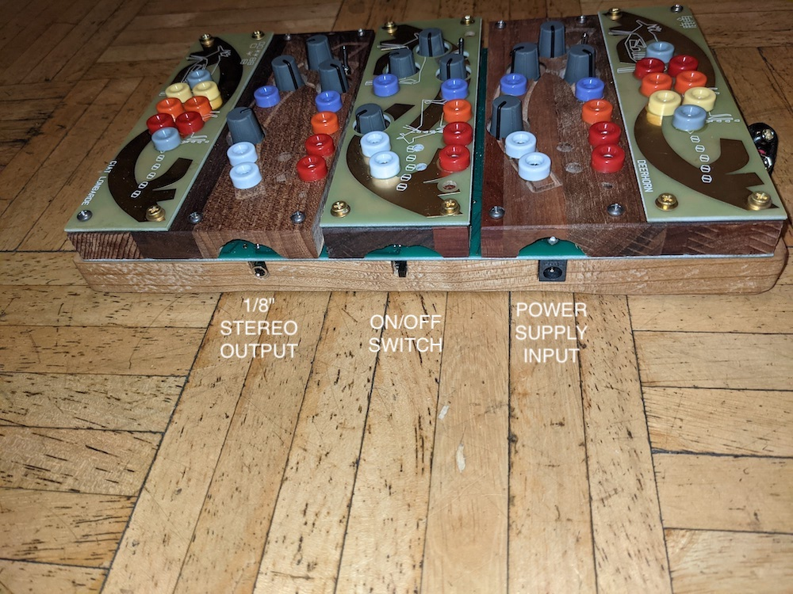
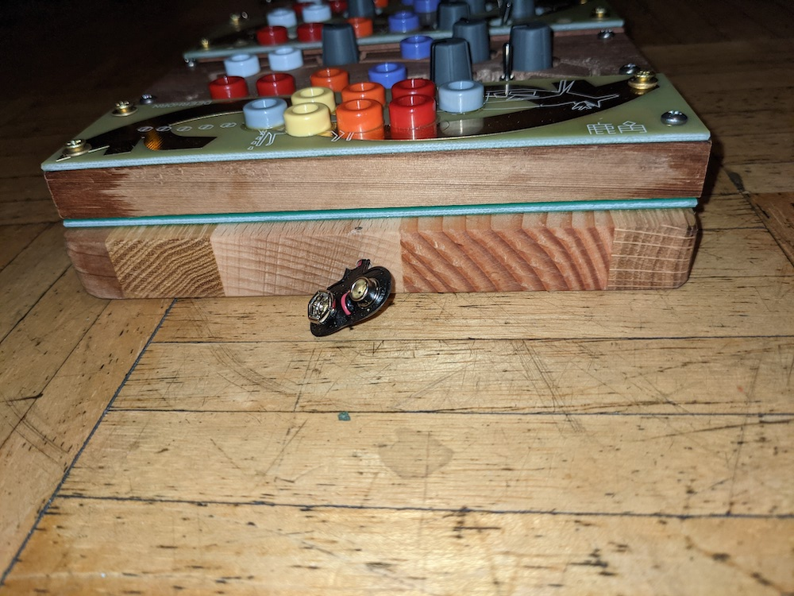
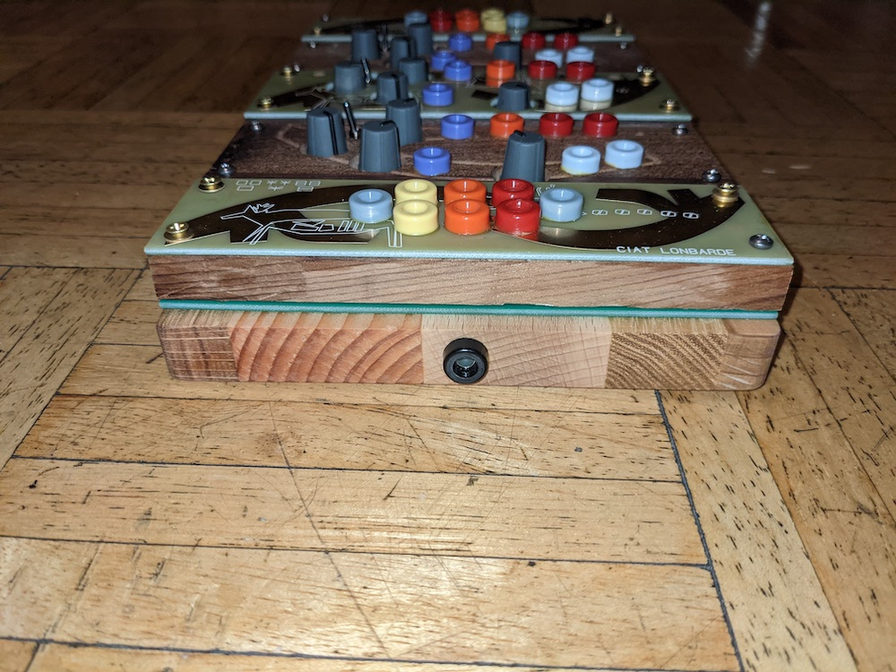

# Deerhorn organ

## About

This notes are based on my Deerhorn Organ, acquired from Patch Point in 2021.

## Images

### Front

### Up

### Down

### Left

### Right

### Back

# Audio

3 stereo inputs
1 stereo output

# Jacks

Banana jacks

37 jacks

* 4x gray
* 4x yellow
* 7x orange
* 10x red
* 6x white
* 6x purple

# Knobs

12 knobs

# Sensors

3 horns

# Lights

6x lights

* 2x red
* 2x orange
* 2x yellow
